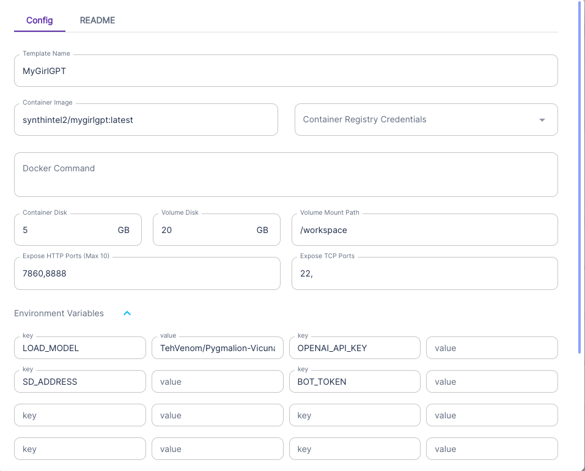

## How to Build a Docker Image
To build a Docker image, use the following command:

```
docker build -t mygirlgpt .
```

## How to Run in Runpod
To run in Runpod, follow these steps:

1. Add a new template and fill in the required information, including the template name, container image (use synthintel2/mygirlgpt:latest or your own built image), volume disk (if needed), and exposed HTTP ports (use 7860 for text-generation-webui and 8888 for Jupyter).

2. Add the required environment variables, including LOAD_MODEL (default value is TehVenom/Pygmalion-Vicuna-1.1-7b), OPENAI_API_KEY, SD_ADDRESS, and BOT_TOKEN.

3. Optionally, you can add additional environment variables, such as OPENAI_API_BASE and JUPYTER_PASSWORD.

Here's an example of how to fill in the fields when adding a new template:


4. Start the server by selecting the template and clicking "Continue". Wait for the pod to start up and become ready.

Here's an example of how to start a pod once the template is ready:


Once it's ready, you can start chatting with Cherry.

